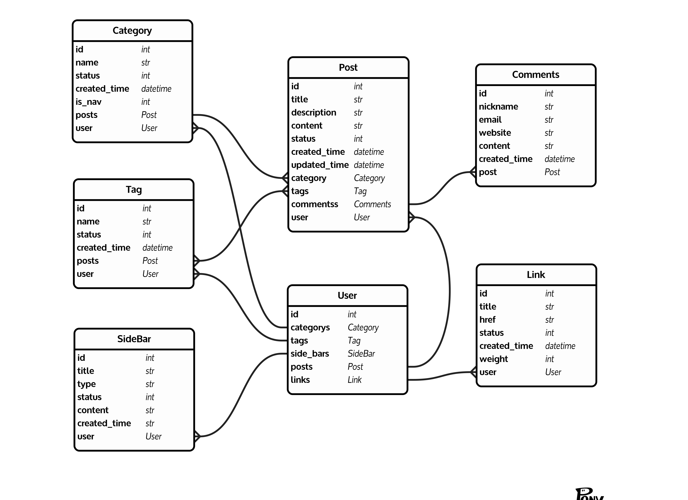
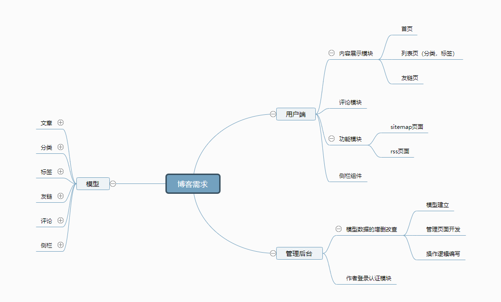

# 1.1  需求文档

## 1. 介绍

​    博客（英语：Blog，为Web Log的混成词），意指log on the we，即在网络上记录，是一个由个人管理的网站或在线日记，可以张贴新的文章、图片和视频，用来记录、抒发情感或分享信息。博客上的文章通常根据张贴事件，以倒叙方式由新到旧排列。

​    许多博客作者专注评论特定的课题或新闻，其他则作为个人日记。一个典型的博客结合了文字、图像、其他博客或视频的超链接以及其他与主题相关的媒体，能够让读者以互动的方式留下意见，这些是许多博客的重要要素。大部分的博客雷人以文字为主，也有一些博客专注于艺术、摄影、视频、音乐和播客等主题。博客是社会媒体网络的一部分。

## 2. 需求描述

简单来说，博客系统分为两部分：读者访问部分（用户端）和作者创作部分（作者端）。

用户端的需求如下：

- 要能够通过搜索引擎搜索到博客内容，进而来到博客
- 可在博客中进行关键词搜索，然后展示出文章列表
- 能够根据某个分类查看所有关于这一分类的文章
- 访问首页时，需要能查看到由新到旧的文章列表，以便于查看最新的文章
- 要能够通过RSS阅读器订阅博主的文章
- 要能够对某一篇文章进行评论
- 能够配置友链，方便与网友进行链接

作者端的需求如下：

- 博客后台需要登录方可进入
- 能够创建分类的标签
- 能够以Markdown格式编写文章
- 能够上传文章配图，要有版权声明
- 能够配置导航，以便引导读者
- 作者更新后，订阅读者能够收到通知

# 1.2 需求评审

## 1. 博客需求评审

### 1. 用户端部分

- **要能够通过搜索引擎搜索到博客内容，进而来到博客**。从技术上说，这个属于SEO的部分，只需要提供sitemap（网站地图）到搜素引擎即可。同时，页面需要对爬虫友好。需要明确的事情是，技术上无法保证一定能够通过搜素引擎搜索到博客，这最终取决于搜索引擎。
- **可在博客中进行关键词搜索，然后展示出文章列表**，需要明确搜素哪些字段，比如标题、标签和分类等。如果需要进行全文搜索，就要考虑数据量的问题。如果数据量过大，就不能直接使用MySQL的LIKE语句，需要增加全文搜索相关的技术栈，比如引入*Whoosh*、*Solr*、*Elasticsearch*这样的搜索引擎。
- **可根据某个分类或标签查看所有关于这一分类或标签的文章**。对于分类，要明确的是有没有子分类这样的需求，如果有子分类，那么子分类的文章要不要在父分类下展示，以及子分类的层级有没有限制。
- **访问首页时，需要能看到由新到旧的文章列表，以便于查看最新的文章**。首页排序从新到旧没问题，是否有特列，比如某些文章必须置顶。另外，是通过分页的方式展示列表，还是页面可以不断下拉加载的方式。每个页面/每次加载多少条数据。
- **要能够通过RSS阅读器订阅博主的文章**。需要提供RSS格式数据的页面。
- **要能够对某一篇文章进行评论**。是否需要前台（用户端）查看所有评论的页面。
- **能够配置友链，方便与网友进行链接**。友链在前台如何展示，是单独的页面还是一个列表页。

### 2. 作者端部分

- **博客后台需要登录方可进入**。是否有多用户登录的需求？如果有，那么用户之间的权限如何划分？
- **能够创建分类和标签**。跟上面的问题一样，是否有多级分类和标签的情况，如果有，需要明确父级分类和标签是否包含子级所关联的内容。
- **能够以Markdown格式编写文章**。作者编写文章时，有哪些是必填的，在网页上编写是否需要实时保存。
- **能够上传文章配图，要有版权声明**。版权声明具体表现为什么？
- **能够配置导航，以便引导读者**。导航是否指分类？是否包含标签？
- **作者更新后，订阅读者能够收到通知**。在博客的整个需求中，并没有需要读者登录的账户系统，无法对读者进行实时通知。但是可以考虑增加邮件订阅功能，通过邮件的方式通知读者。此时需要明确邮件的内容格式，以及作者是否需要控制发送邮件的开关。

# 1.3  功能分析

## 1. 需求列表

### 1. 用户端部分

- 网站需要对SEO友好，具体可参照搜索引擎站长白皮书。另外，需要给搜索引擎提供XML格式的sitemap文件。
- 博客需要提供搜索功能，搜索范围限定在标题、分类和标签。博客每天的增量数据为10篇文章。
- 能够根据某个分类查看所有关于这一分类的文章，分类没有层级的关系，只有一级分类。一篇文章只能属于一个分类。
- 访问首页时，需要能看到由新到旧的文章列表，以便于查看最新的文章。作者可以设置置顶某篇文章，也可以同时置顶多篇文章。多篇文章置顶时，排序规则从新到旧。
- 列表分页需求。针对首页、频道页和标签页，都需要提供分页需求，每页展示10篇文章。列表页展示文章时，需要展示摘要，默认为文章的前140个字。
- 需要能够通过RSS阅读器订阅博主的文章，具体可参考RSS规范。
- 要能够对某一篇文章进行评论。评论不需要支持盖楼的模式，只需要在文章页面展示评论。在页面侧边栏，也需要能展示最新评论。
- 能够配置友链，方便与网友进行链接。在这一个页面中展示即可，不需要分类。但是需要能够指定某个友链的权重，权重高者在前面展示。

### 2. 作者端部分

- 博客后台需要登录方可进入。目前没有多用户需求，以后可能会有，要考虑可扩展。
- 能够创建分类和标签，一篇文章只能属于一个分类，但是可以有多个标签。标签和分类没有层级关系。
- 作者在后台需要设置文章标题、摘要（如果为空，则默认展示文章前140个字）、正文、分类和标签。不需要实时保存。文章格式默认为Markdown。开发周期够的话，增加可视化编辑器。
- 增加文章配图时，图片需要增加水印，其内容为网站网址。
- 导航只是分类，默认展示在顶部。同时每篇文章都需要有浏览路径，以告知读者目前所处位置。浏览路径的组成为：首页>文章所属分类>正文。对于导航的顺序，作者可以设置权重，权重高者在前。顶部最多展示6个分类，多余的分类则展示到底部。
- 作者更新后，读者能够收到通知（暂时不开发）。

## 2. 功能点梳理

从上面最终确定过的需求列表中，我们可以逐条列出博客系统所需要的功能点有如下这些：

- 后端渲染页面，对SEO友好
- 提供sitemap.xml文件，输出所有文章
- 搜索功能，能够针对标题、分类和标签进行搜索
- 根据分类和标签查看文章列表
- 文章可以设置置顶，可以同时设置多篇文章置顶
- 首页（列表页）需要展示文章摘要，140字以内，可以作者填写，或者自动展示文章前140个字
- 首页（列表页）需要分页展示，每页10条
- 提供RSS页面，根据RSS2.0规范输出内容
- 文章页面支持评论，不需要盖楼，侧边栏能够展示最近评论
- 评论模块需要增加验证码功能，避免被刷
- 后台能够配置友链，所有友链在一个页面中展示
- 所有用户通过用户名和密码登录后台，之后才能创建文章
- 需要考虑多用户的扩展情况，多用户需要对分类、标签、文章、友链的操作权限进行隔离
- 分类增、删、查、改——需要字段id、名称、创建日期、创建人、是否置顶导航以及权重
- 标签增、删、查、改——需要字段id、名称、创建日期、创建人
- 文章增、删、查、改——需要字段id、标题、摘要、正文、所属分类、所属标签、状态（发布、草稿或删除）、创建日期和创建人
- 侧边栏模块用来展示侧边栏需要的数据、需要字段id、类型、标题、内容、创建日期和创建人

# 1.4 模块划分

## 1. 实体与关系

### 1. 文章

- id
- 标题
- 作者
- 分类（多对一）
- 标签（多对多）
- 摘要
- 正文
- 状态
- 发布时间

### 2. 分类

- id
- 名称
- 状态
- 作者
- 创建时间
- 是否置顶导航

### 3. 标签

- id
- 名称
- 状态
- 作者
- 创建时间

### 4. 友链

- id
- 网站名称
- 链接
- 作者
- 状态
- 创建时间
- 权重

### 5. 评论

- id
- 文章（多对一）
- 用户名
- 邮箱
- 网站地址
- 内容
- 创建时间
- 作者

### 6. 侧栏

- id
- 标题
- 类型（最近文章/最热文章/最近评论/内容）
- 内容
- 创建时间
- 作者

>  这里我使用Pony ORM的在线工具画出对象实体模型，如图所示：

## 2. 模块划分

### 1. 用户端部分

- 内容模块：首页、分类列表页、标签列表页和友链页
- 评论模块：用户添加评论、展示评论的部分
- 侧栏模块：博客侧边栏展示的内容
- 功能模块：sitemap页面和RSS页面

### 2. 作者端部分

- 用户管理：登录、权限控制
- 内容管理：分类、文章以及侧边栏等内容的增、删、查、改

